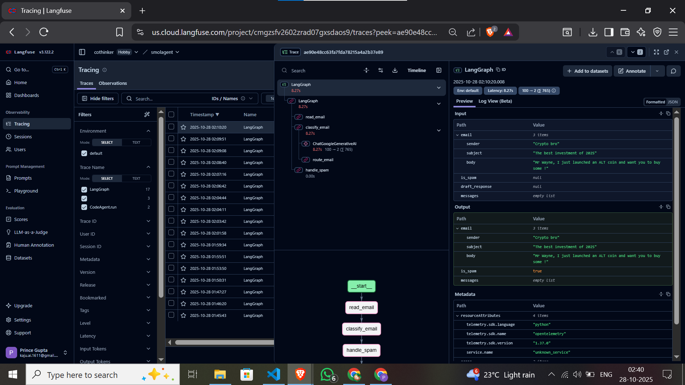

# 🤖 AI Email Triage Agent (LangGraph + Gemini + Langfuse)

This project demonstrates a stateful, autonomous AI agent built with **LangGraph** to process incoming emails. The agent uses **Google's Gemini 2.5 Pro** model to classify emails, routes them based on the classification, and takes appropriate action. The entire workflow is traced and monitored using **Langfuse** for complete observability.

## 🚀 Features

* **Spam Detection**: Automatically classifies emails as "SPAM" or "HAM" (legitimate) using an LLM.
* **Conditional Routing**: Uses LangGraph's conditional edges to route the workflow based on the classification.
* **Automated Actions**:
    * **Spam**: Moves the email to a "spam" folder (simulated).
    * **Legitimate**: Drafts a polite, professional reply for human review.
* **Human-in-the-Loop**: Notifies the user ("Mr. Kaju" in this demo) and presents the drafted response for approval.
* **End-to-End Observability**: Integrates with Langfuse to trace every step, LLM call, input, and output of the agent's execution.

---

## 🛠️ Tech Stack

* **LangGraph**: For building the stateful, multi-step agent graph.
* **LangChain**: For core abstractions and LLM integration (`langchain-google-genai`).
* **Google Gemini**: The generative AI model (`gemini-2.5-pro`) used for classification and drafting.
* **Langfuse**: For application-level tracing and observability.

---

## ⚙️ Installation & Configuration

1.  **Clone the Repository**
    ```bash
    git clone [https://github.com/your-username/your-repository-name.git](https://github.com/your-username/your-repository-name.git)
    cd your-repository-name
    ```

2.  **Create a Virtual Environment**
    ```bash
    python -m venv venv
    source venv/bin/activate  # On Windows, use `venv\Scripts\activate`
    ```

3.  **Install Dependencies**
    Create a `requirements.txt` file with the following content:
    ```
    langgraph
    langchain_google_genai
    google-generativeai
    langfuse[langchain]
    python-dotenv
    ```
    Then, install them:
    ```bash
    pip install -r requirements.txt
    ```

4.  **Set Up Environment Variables**
    Create a file named `.env` in the project's root directory and add your API keys:

    ```.env
    # Get from [https://aistudio.google.com/app/apikey](https://aistudio.google.com/app/apikey)
    GOOGLE_API_KEY="your_google_api_key_here"

    # Get from your Langfuse project settings
    LANGFUSE_PUBLIC_KEY="your_langfuse_public_key_here"
    LANGFUSE_SECRET_KEY="your_langfuse_secret_key_here"
    LANGFUSE_HOST="[https://us.cloud.langfuse.com](https://us.cloud.langfuse.com)" # Or your specific region (e.g., [https://cloud.langfuse.com](https://cloud.langfuse.com) for EU)
    ```
    The Python script will need to load these. Add this to the top of your script:
    ```python
    import os
    from dotenv import load_dotenv

    load_dotenv()
    # Your os.environ["GOOGLE_API_KEY"] calls will now work
    ```

---

## 📈 Agent Workflow

The agent's logic is defined as a graph. You can visualize this graph by running the `compiled_graph.get_graph().draw_mermaid_png()` part of the script.


The flow is as follows:

1.  **`read_email`**: The entry point that receives the email data.
2.  **`classify_email`**: An LLM call (Gemini) determines if the email is `SPAM` or `HAM`.
3.  **`route_email` (Conditional Edge)**:
    * If **"spam"**: The graph transitions to the `handle_spam` node.
    * If **"legitimate"**: The graph transitions to the `drafting_response` node.
4.  **`handle_spam`**: Simulates moving the email to spam and ends the process.
5.  **`drafting_response`**: An LLM call (Gemini) drafts a polite, professional reply.
6.  **`notify_mr_kaju`**: Simulates notifying the user by printing the drafted email to the console for review.
7.  **`END`**: The process finishes.

---

## 📊 Observability with Langfuse

This project is fully integrated with Langfuse. The `langfuse_handler` is passed to the graph's `.invoke()` method, which automatically captures the entire trace of the execution, including all node inputs/outputs and LLM calls.

This allows you to easily debug the agent's decisions, track costs, and monitor performance.

### Example Trace: Legitimate Email

Here is the trace from Langfuse when processing a legitimate email. You can see the full "ham" path: `read_email` -> `classify_email` -> `drafting_response` -> `notify_mr_kaju`.


### Example Trace: Spam Email

Here is the trace when processing a spam email. The graph correctly follows the conditional "spam" path: `read_email` -> `classify_email` -> `handle_spam`.


